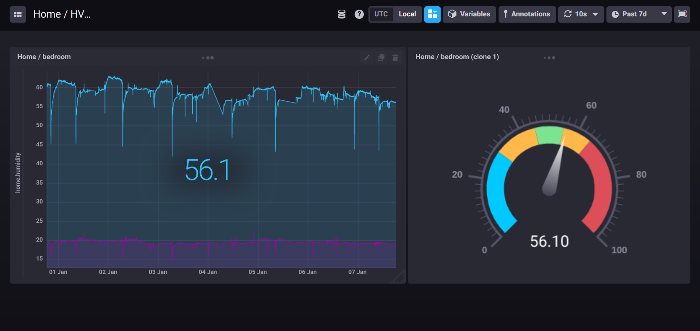

axon-go
=======

## About

The main motivation behind the creation of this project was to have a generic system integration concept and a handful set of agents that makes possible the implementation of IoT related solutions, such as [HVAC](https://en.wikipedia.org/wiki/Heating,_ventilation,_and_air_conditioning) for home, and [greenhouse](https://walipini.herokuapp.com/), [garden irrigation](https://github.com/tombenke/giri), robotics, etc. on a simple and easy way.

The following figure shows a simple example flow, that collects thermometer and humidity sensor data measured periodically, then store them into a time-series database, that can be visualized.


The collected data is visualized by the [Chronograf](https://docs.influxdata.com/chronograf/v1.7/) dashboard, as you can see on the following figure:



## Architectural considerations

The [Event Driven System Design](http://www.allitebooks.org/event-processing-in-action/) and Event Driven Architectures fit very well to IoT and automation problems. Such events of the distributed system can be efficiently forwarded via messages, using messaging middlewares, such as [MQTT](http://mqtt.org/), [RabbitMQ](https://www.rabbitmq.com/), [NATS](https://nats.io/), etc. Then the system components, that produce, consume, process the messages can be integrated via the messaging middlewares applying the [Enterprise Integration Messaging Patterns](https://www.enterpriseintegrationpatterns.com/patterns/messaging/index.html).

Axon follows the philosophy of distributed system architectures to integrate hardware and software components, that are running on a wide range of hardware and OS platforms, and are written in several languages. It is also an important part of the philosophy to use as many existing components that are available, as possible, and implement only the missing ones.

_Important NOTE:_ __Axon is not a framework, neither a single monolithic application. It is rather a concept of how to do message-based system integration.__

## The axon-go project

This project holds event-driven agents implemented in [Go](https://golang.org/), that are communicating via [NATS ](https://nats.io/) channels with each other.

Axon is a set of independent components, that can be written in any programming languages, which has a library to access [NATS](https://nats.io/). The components are event driven agents that either consume and/or produce messages through NATS. These agents use NATS subjects for communicating with each others.

_Why [NATS](https://nats.io/)? Why not [MQTT](http://mqtt.org/)?_

In fact [MQTT](http://mqtt.org/) is also can be used, however it is even possible to easily bridge the messages between the two kind of middleware, using gateway components. On the other hand axon-go uses [NATS](https://nats.io/) subjects, and streaming, because this technology is extremely well scaleable. It easily fits into the memory of a [NanoPi](http://wiki.friendlyarm.com/wiki/index.php/NanoPi_NEO) Raspberry Pi clone, and runs smoothly, on the other hand it is able to scale up to a multi-cloud cluster. There are clients implementedin many programming languages, and these also can run a many platforms, e.g. on an [Arduino](https://www.arduino.cc/en/main/software), or an [ESP8266](https://en.wikipedia.org/wiki/ESP8266), or [ESP32](https://en.wikipedia.org/wiki/ESP32) just to mention some extremes.

Another important aspect is the integration patterns could be used. [NATS](https://nats.io/) provides all the patterns needes, e.g. RPC-like request-respose, async topic-like subject, in-memor or persistent streams, worker-groups, etc. So the designer of the flow can apply all these patterns without any limitation, and the agents implemented here might be use in a very wide range of environments, with totally different purposes.

### Messages

#### The structure of the messages

The structure of the messages a given kind of agent is able to consume,
or produces depends on the specific agent, as well as it depends on the agent's behavior, although there is a generic format of the messages:

```JavaScript
{
    type: "the-type-of-the-message", // Optional
    meta: { // Optional
        // Meta information about the message itself,
        // and the properties contained by the `body part of the message`
    },
    body: {
        // The payload of the message.
        // This can be a flat list of properties or an object hierarcy, or even an empty object.
    }
}
```

This is an example that the `axon-cron` agent emits:

```JavaScript
    {
        "type":"measure",
        "meta":{
            "timePrecision":"ns"
        },
        "body": {
            "time":1578563641000543512
        }
    }
```

This is another example that the sensor units send after doing the measurement:

```JavaScript
    {
        "type":"measurement",
        "meta":{
            "timePrecision":"ns"
        },
        "body":{
            "time":1578563461000510976,
            "device":"6cfde020-fcd8-493f-9f6c-d8415b4a3fd5",
            "temperature":19.30,
            "humidity":57.40
        }
    }
```

__NOTE: Currently the `time` property of the `axon-cron` agent is placed directly into the root of the message body, that will change soon, according to the generic schema describen above.__

For further details on the message formats, study the desicprion of the specific agents.

#### The representation format of the messages

Currently the agent implementations use JSON representation formats for the messages, on the other hand it may not optimal for all kind of applications, such as real-time robot control for example. So other, more optimal formats can also be used. most probably the agents will be extended soon to be able to handle other formats, such as the [Google's Protocol Buffer](https://developers.google.com/protocol-buffers) representation. Protocol buffers are a language-neutral, platform-neutral extensible mechanism for serializing structured data.

That is even possible to combine several representational formats in different parts of the same flow, depending on the needs.

### Agents

The project delivers a small set of predefined agents, such as `axon-cron`, `axon-debug`, `axon-influxdb-writer`, that are compiled and can be executed as standalone applications.

From a given perspective, axon is similar to the [Node-RED](https://nodered.org/)
in the meaning that its agents work similarly like the [Node-RED](https://nodered.org/) components.
There are three fundamental differences relative to [Node-RED](https://nodered.org/):

1. the axon agents' inputs and outputs are NATS subjects, or channels,

2. the agents can be written in any language,

3. the agents can run on different machines and in any number of instances.

This project currently provides only a handful of agents:

- [`axon-cron`](axon-cron/README.md)
- [`axon-debug`](axon-debug/README.md)
- [`axon-influxdb-writer`](axon-influxdb-writer/README.md)

## Installation

### Deploy only

In case you only want to use the agents, then you can use the pre-compiled binaries
that you find under the `dist/` folder.

Select the platform you want to use, download the binaries into a folder of your preference, and make sure that folder is set into the `PATH`.

If you want to start the agents of the flows under one parent process, like if it were a single application, then you also need to install a foreman-like process manager, e.g. [foreman](https://nodered.org/), [forego](https://github.com/ddollar/forego), [node-foreman](https://github.com/strongloop/node-foreman), etc.

### For development

If you want to compile from source, then clone the repository, or install it via the `go get` command.

```bash
    go get https://github.com/tombenke/axon-go
```

Then you need to build the common module, and install the agents one-by-one.

To build the agents to several platforms, run the `build.sh` script from the root of the project folder.

The axon package contains a `common` module, that provides generic functions for the agents,
e.g. connecting to the NATS server, etc.

## Examples

The [`examples`](examples/) demonstrates how to run simple and more complete networks of agents. It also demonstrates how to start flows using foreman like they were single applications.

The examples:

- [`cron-echo/`](examples/cron-echo/): The most simple flow that sends timestamp at regular intervals then prints them to the console.
- [`th-sensor/`](examples/th-sensor/): This flow collects thermometer and humidity sensor data measured periodically, then store them into a time-series database, that can be visualized.

