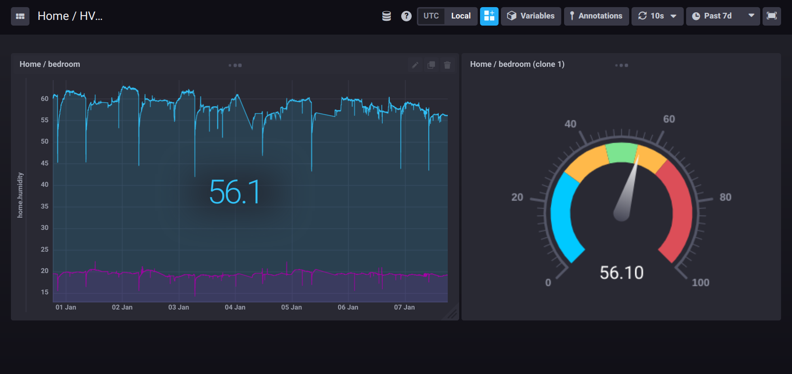

The `th-sensor` flow
====================

The following figure shows a more advanced flow, that collects thermometer and humidity sensor data measured periodically, then store them into a time-series database, that can be visualized.

This flow is triggered by the `axon-cron` agent, and there are sensor agents, that do measurements, when they got the trigger message from the `axon-cron`, then forwards the measured results towards the `influxdb-writer` agent, that will store the data into a time-series database, called [`InfluxDB`](https://docs.influxdata.com/influxdb/v1.7/).

This [`axon-sensor-th` component](https://github.com/tombenke/axon-sensor-th) is implemented in C++ using an Arduino library, and runs on an ESP8266 device. 

The collected data is visualized by the [Chronograf](https://docs.influxdata.com/chronograf/v1.7/) dashboard, as you can see on the following figure:

